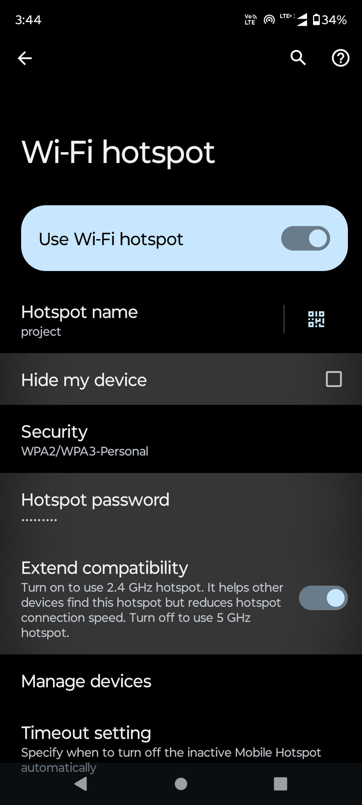

# Smart Home Automation using ESP32 and Blynk

## 📌 Overview
This project implements a low-cost IoT-based Smart Home Automation System using ESP32 and the Blynk IoT platform.

The system enables remote control of appliances, motion-triggered lighting, temperature monitoring, and secure cloud communication.

---

## 🛠 Hardware Components
- ESP32-WROOM-32
- PIR Motion Sensor (HC-SR501)
- DHT22 Temperature & Humidity Sensor
- 5V Relay Module
- L298N Motor Driver
- 12V LED Light
- Axial Fan

---

## 💻 Software Stack
- Arduino IDE
- Blynk IoT Platform
- WiFiManager Library
- DHT Sensor Library

---

## 📂 Project Structure

Smart-Home-Automation-ESP32/
│
├── code/
├── images/
├── report/
└── README.md

---

## 🖼 System Images

### Hardware Setup

### Working Demonstration

---

## 📄 Project Report
Full documentation available here:

[View Project Report](report/smart-home-automation.pdf)

---

## 🔐 Security Features
- Token-based authentication
- WPA2 network encryption
- TLS-secured cloud communication
- BLE fallback option

---

## 👨‍💻 Authors
- Hema Chandra  
- Hanuman  
- Koushik Reddy  
- Uddhav Menon  

SRM Institute of Science and Technology

